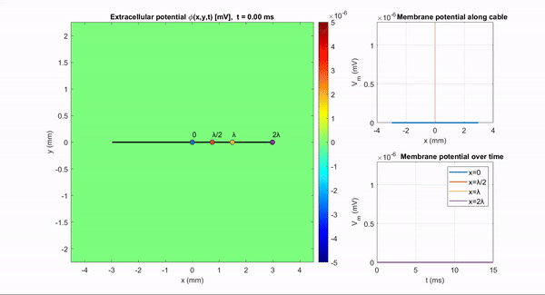

# Cable theory demo
These are demonstrations in response to my Wiki article: [Where does 1/f power distribution come from?](https://sccn.ucsd.edu/wiki/Makoto%27s_preprocessing_pipeline#Where_does_power_distribution_come_from.3F_.28For_510.2C000_page_views.2C_Added_on_09.2F17.2F2025.29) For detail, please read that main article linked.

